# Microsoft Azure AzurePass Activation 

#### Steps to Activate Azure Pass

 - Before You begin, make sure you read the notes below!!! You been warned !!
  
 >>NOTE: **It is recommended you close all browsers and open a new In-Private Browser session.** 

 >>NOTE: **Other log-ins can persist and cause errors during the activation step.** 

 >>NOTE: **Microsoft Azure Pass Subscription runs on isolated DNS, if you have any VPN, please disconnect before going thru this process, failing to do so, activation may cause error** 

 - Before You begin, make sure you read the notes above!!! You been warned !!

 - Open a browser and navigate to: www.microsoftazurepass.com

 - Click the start button to get started.
 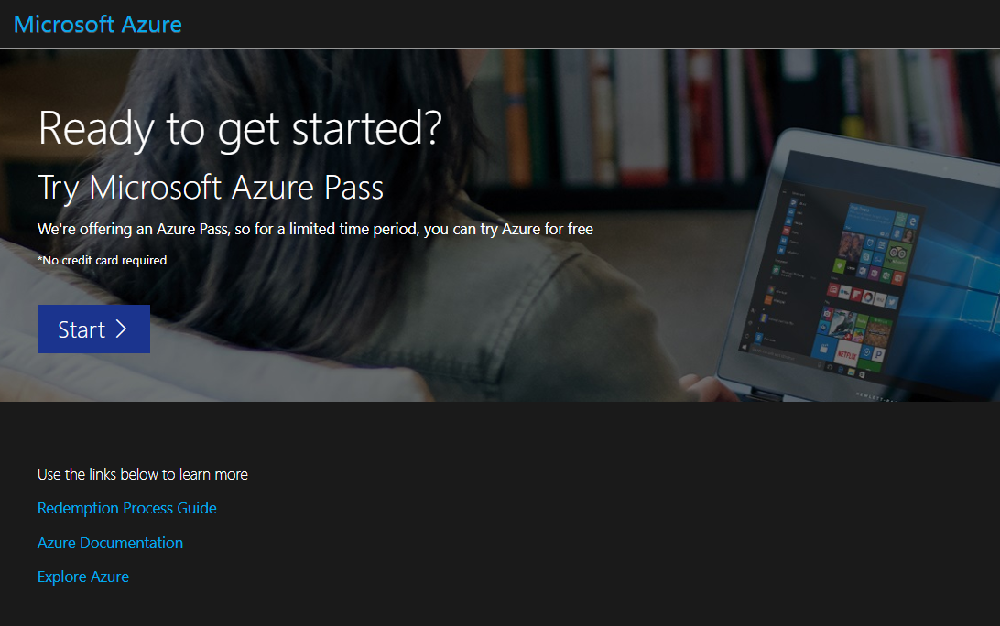  

 - Once you click the start button on the site, you are required to login with a valid microsoft account
 - You need to create a new @outlook.com or @hotmail.com account 
 - DO NOT use any existing hotmail or outlook account that been associated with any Microsoft Azure/DevOps/MS365 service
 >>NOTE **YOU BEEN WARNED** 

 - Select **Use another account** 
 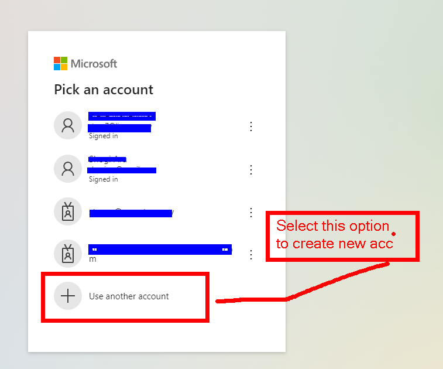  

 - Create a new Account and follow the steps 
 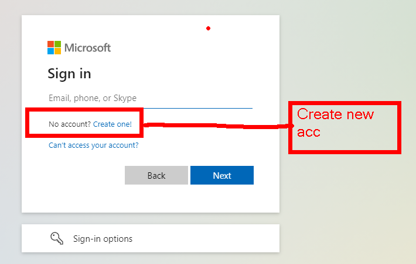  

 - Select **Create a new account** 
 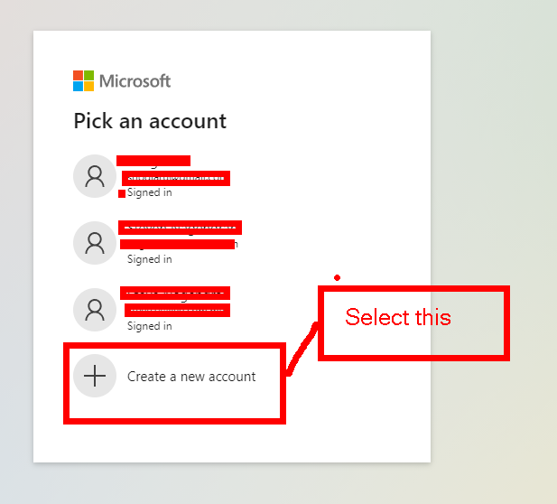  

 - Select **Get a new email address** 
 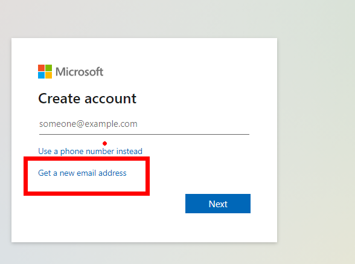  
 
 - Use outlook.com or hotmail.com with a new alias
 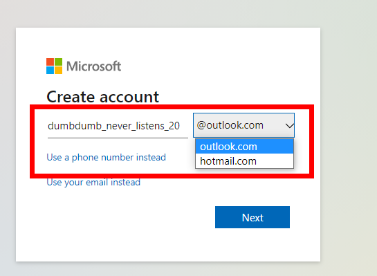  
 

 - Create a Password for your Alias.   
 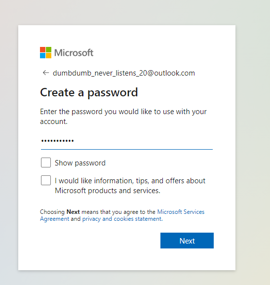  
 

 - Once the hotmail/outlook account created, you will redirected to Azure Pass Site (pay attention to Microsoft Email and click confirm Microsoft Account)
 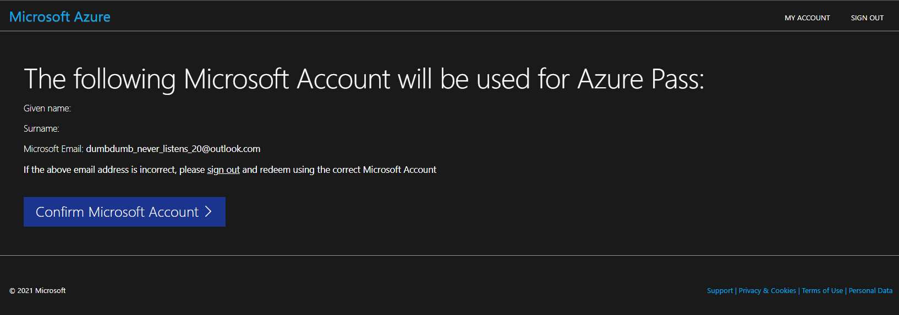  
 
 - Enter your promo code in the Promo code box and click “Claim Promo Code”.
 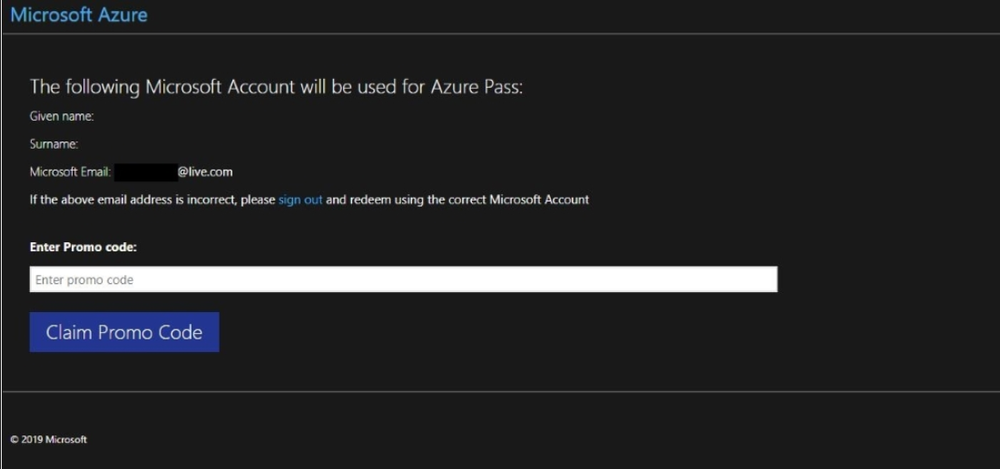  

 - It may take up to 5 minutes to process the redemption.
 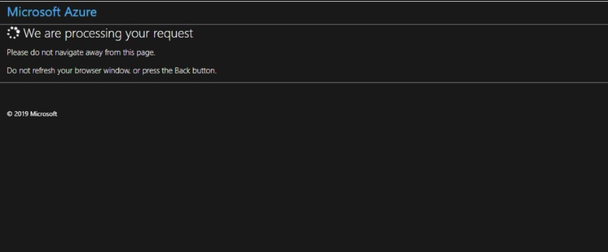  

 - When the redemption process is completed, it will redirect to the sign up page, enter your information and click next
 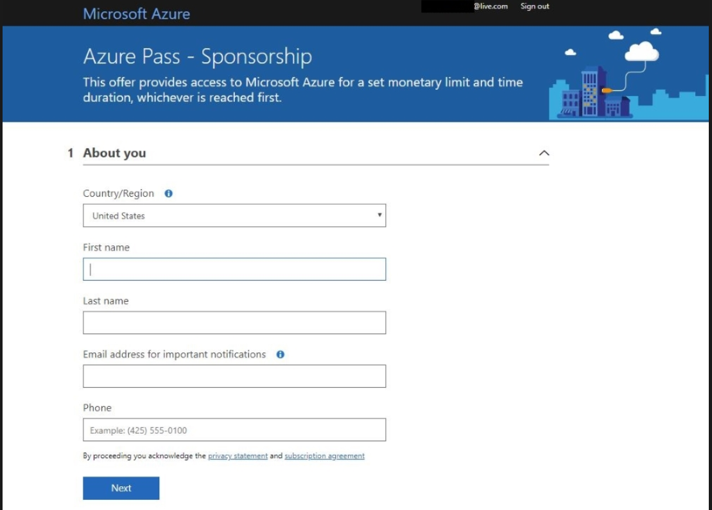  

 - Click the agreement check box and click the Sign up button. It may take a few minutes to process the request.
 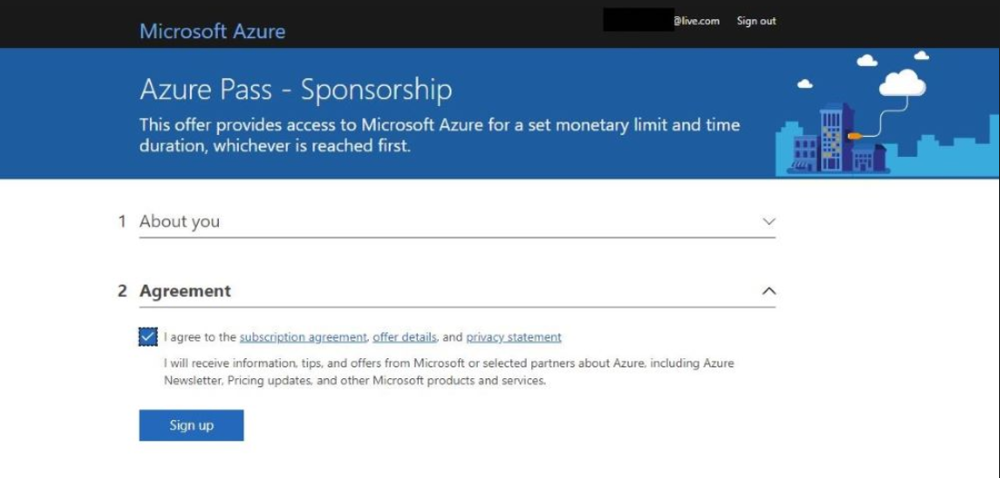  

 - Once the sign up process Done, You will be redirected to Azure Portal, and Your Subscription is Ready
 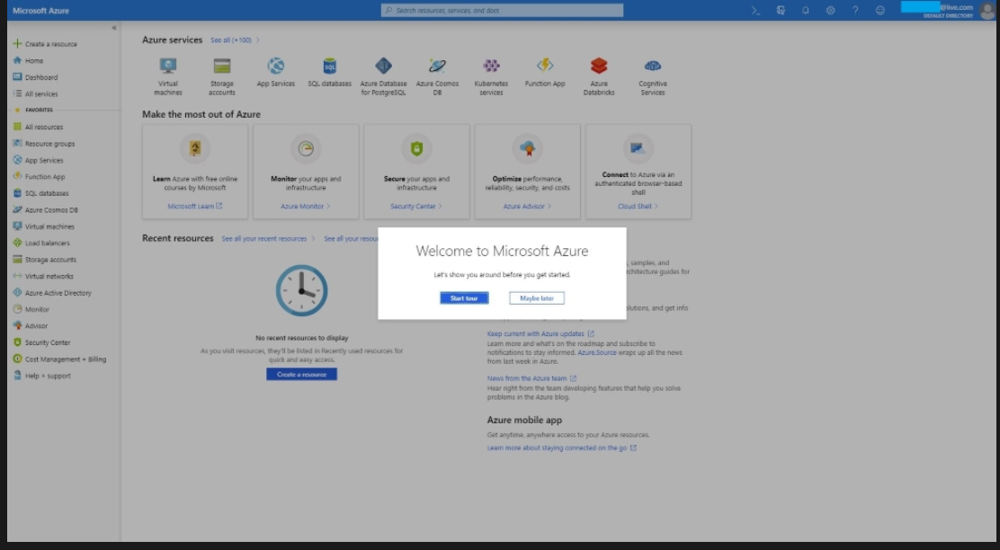  

